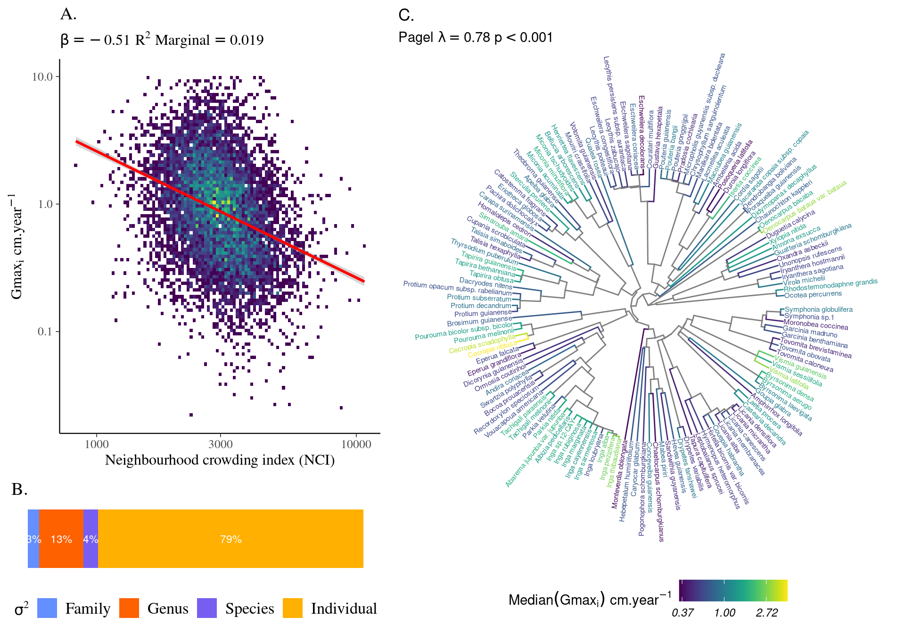

# [Tree Growth](https://sylvainschmitt.github.io/treegrowth/)

Variation in the growth potential of individual trees at the Paracou research station.

*Figure 1: Variation in the growth potential of individuals and species as a function of neighbourhood crowding, taxonomic levels or across phylogeny. A. Individual growth potential (Gmaxi) is significantly decreasing with neighbourhood crowding index (NCI, =-0.99, p<0.001, R2=0.102). B. The variation of individual growth potential (Gmaxi) across taxonomy show most of the variation at the individual (=0.45, Tab. 1), then explained by genus (=0.09) before species (=0.04) and family (=0.06).  C. The distribution of species growth potential (Median[Gmaxi]) across the phylogeny from slow growing species in dark blue to fast growing species in yellow (log-scale) is phylogenetically structured (Pagel’s =0.78, p<0.001) with a significant positive autocorrelation to a phylogenetic partistic distance below 100 (Fig. S2), corresponding to the genus level (Tab. 1).*
